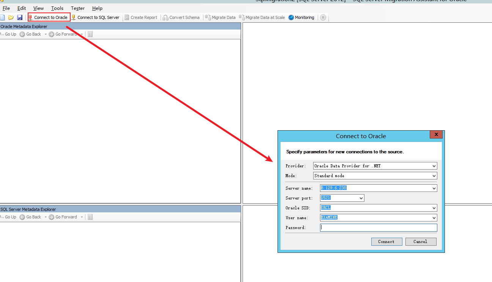
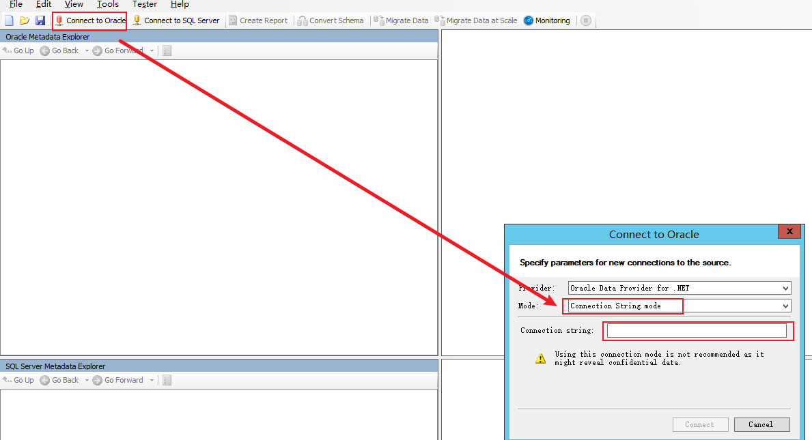
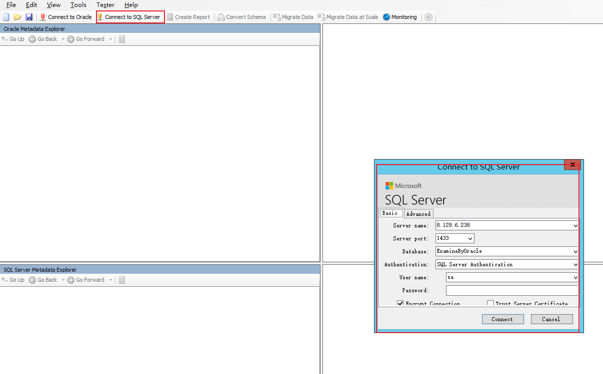
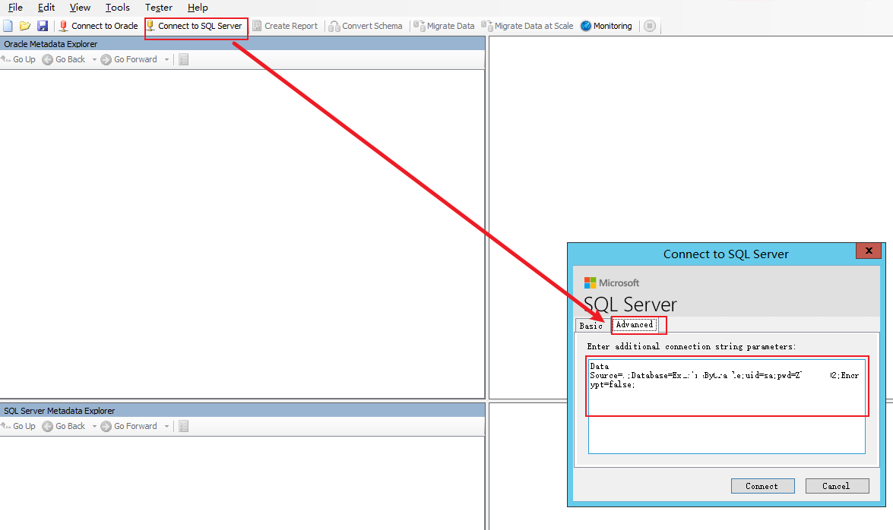
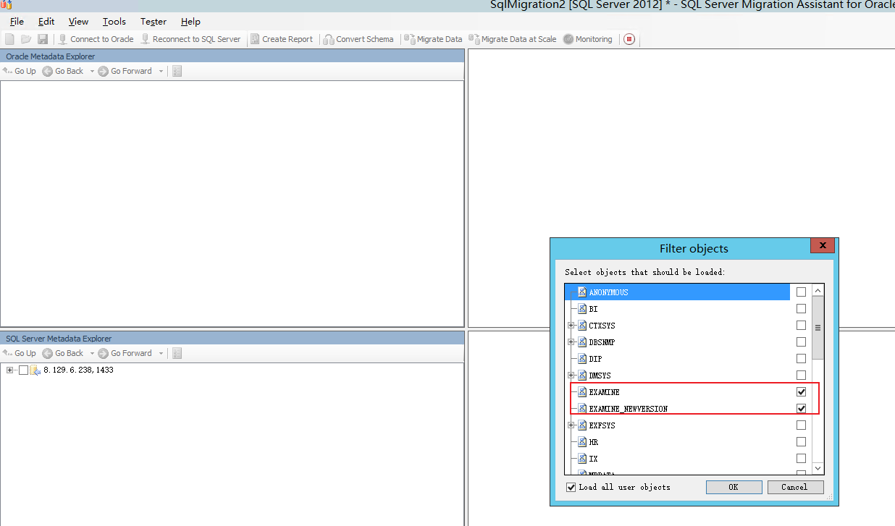
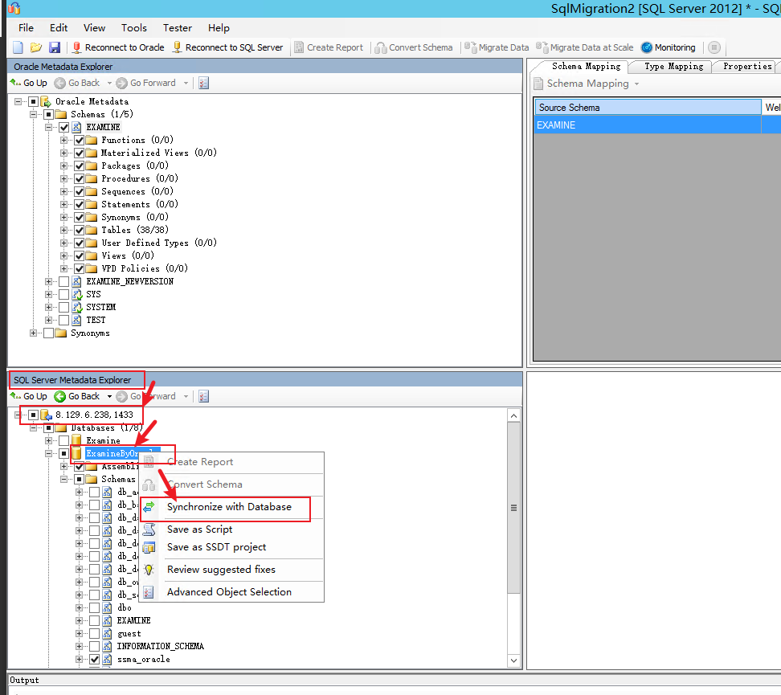

#### Microsoft SQL Server Migration Assistant for Oracle
> Microsoft SQL Server Migration Assistant for Oracle == SSMA

* 使用 **Microsoft SQL Server Migration Assistant for Oracle** 做迁移会省很多事情，当然不可做到百分百，还是需要调整数据表名称、结构、数据值的。

#### 下载
* 下载地址直接去搜微软官方为准，且也是免费的。

#### 安装
* 安装直接默认下一步下一步即可，但是要注意一个选项就是选典型模式（TY开头的，记不住全称）。

#### 创建项目
1. File
2. New Project
3. 选好目标目标数据库也就是SQL server版本，然后OK。

#### 配置连接数据库
1. 连接Oracle，如下图：
    

    但是用这种方式连接不了Oracle，只能用字符串的方式，如下图：
    

    ```
        Data Source=(DESCRIPTION =(ADDRESS_LIST =(ADDRESS = (PROTOCOL = TCP)(HOST = 127.0.0.1)(PORT = 1521)))    (CONNECT_DATA =(SID = ORCL)(SERVER = DEDICATED) ));User Id=EXAMINE;Password=EXA****99;
    ```

    最后再Connect。
2. 连接SQL Server，如下图：
    

    **但是** ，连接SQL server时使用这种方式连接默认数据库是连接不了的，因为这样会把相关信息数据加密后再去请求数据库，这时候就请求不了，因为SQL server识别不了还是怎么，具体原因不知，反正这个方式我无法直接使用也还未探索到方法原因。

    **解决方法：** 使用 **字符串** 的方式进行连接SQL server，有个隐患就是这种方式是明文的方式容易被拦截获取到信息，所以尽量是在本地服务器上做此操作（非要连接外网的方式我是没试过）。如下图：
    

    ```
        Data Source=8.129.6.238;Database=ExamineByOracle;uid=sa;pwd=Z******2;Encrypt=false;
    ```
    最后再Connect。

#### 连接Oracle后
1. 选择库，如下图：
    

2. 选中要迁移的数据库和数据，三种选择根据自己需求选，**建议是先结构，再数据库，避免失败造成麻烦**， 如下图：
    

3. 目标库（SQL server），如下图：
    

4. 等待数据迁移完成即可，其中可能存在失败的，注意看失败的原因，一般某个表有失败的情况后，整个表的数据都不会迁移。


#### 结束

